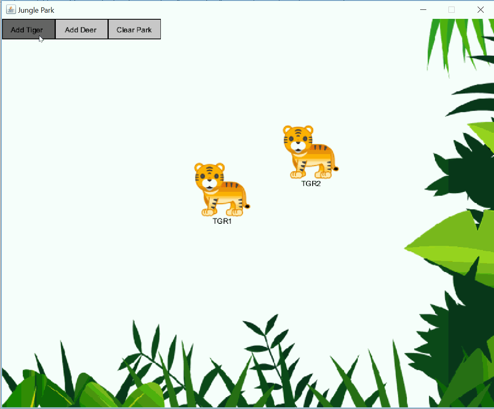

# Jungle-Park-2000

**Jungle-Park-2000** assignment will give you practice with defining interfaces, super classes, and subclasses. We are going to add a new interface, new classes, and new features with respect to JunglePark 1000 application. We’ll work also on improving the clarity and organization of our code. Having this programming assignment as reference, you will be also able to develop a graphical application that extends the PApplet class defined in the processing library, from the scratch. We no longer need to use the Utility class provided for you in the CS300JunglePark.jar file in P2.

Author: **[Ajmain Naqib](mailto:naqib@wisc.edu)**

Course: CS300, Fall 2018    Lecturer's Name: Gary Dahl

Time spent: **4.2** hours spent in total

## Project Introduction
JunglePark 2000 includes different animals. In addition to the Tigers, we will have Deers. After completing assignment, you may add other kinds of animals such as lions, giraffes, monkeys, etc. Note that animals within our JunglePark application share common properties and common features. But, they act differently in the park. Each animal has a specific behavior indeed. We are going to define and implement those similarities and differences in this assignment. We are also going to add new graphic components to our application, such as buttons. 

The goals of this assignment include:

* Use of inheritance and interfaces to better organize your code in a more clear and concise manner. Students would also enjoy the power of polymorphism in this assignment.
* Gain experience with reviewing code for clarity, and improving the readability of your code in different ways.
* Gain more experience with writing tests to assess the correctness of your program. All developed test methods will be run with graphic mode disabled and would assert the correctness of specific methods in your code.

The following **required** functionality is completed:

* [X] CREATE BUTTON CLASSES
* [X] CREATE CLASS DEER AND IMPLEMENT THE DIFFERENT ANIMAL BEHAVIORS
* [X] THE GAME APPLICATION CLASS

Optional: 
* [ ] When the user clicks on any animal, it immediately jumps to a position that is centered around the mouse.  Can you come up with a solution that prevents this from happening, so that the animal (tiger or deer) only moves as a result of mouse dragging and not the initial click?
* [ ] Actually, the only reaction that a deer performs when it detects a tiger at its proximity is to display an ALERT message. You can improve this passive behavior and make the deer move away to escape the threatening tiger, for instance.

More information about this project can be found [here.](http://cs300-www.cs.wisc.edu/wp/index.php/2018/10/09/p5-junglepark-2000/) 

## Video Walkthrough

Here's a walkthrough of implemented functionality:

GIF created with [LiceCap](http://www.cockos.com/licecap/).

## Notes
* You MUST NOT add any additional fields either instance or static to any of the P5 JunglePark 2000 classes, other than those defined in the write-up.
* You MUST NOT add any public methods to your program other than those defined in this write-up.
* You CAN define local variables that you may need to implement the methods that will be defined in this program.
* You CAN define private methods in the Tiger class to help implement the Tiger’s behavior in the jungle park, if needed.
* You CAN define private methods in the JunglePark class if needed.
* You CAN add a public accessor method for eatenDeerCount private field defined in the Tiger class 

## License

    Copyright [2018] [Ajmain Naqib]

